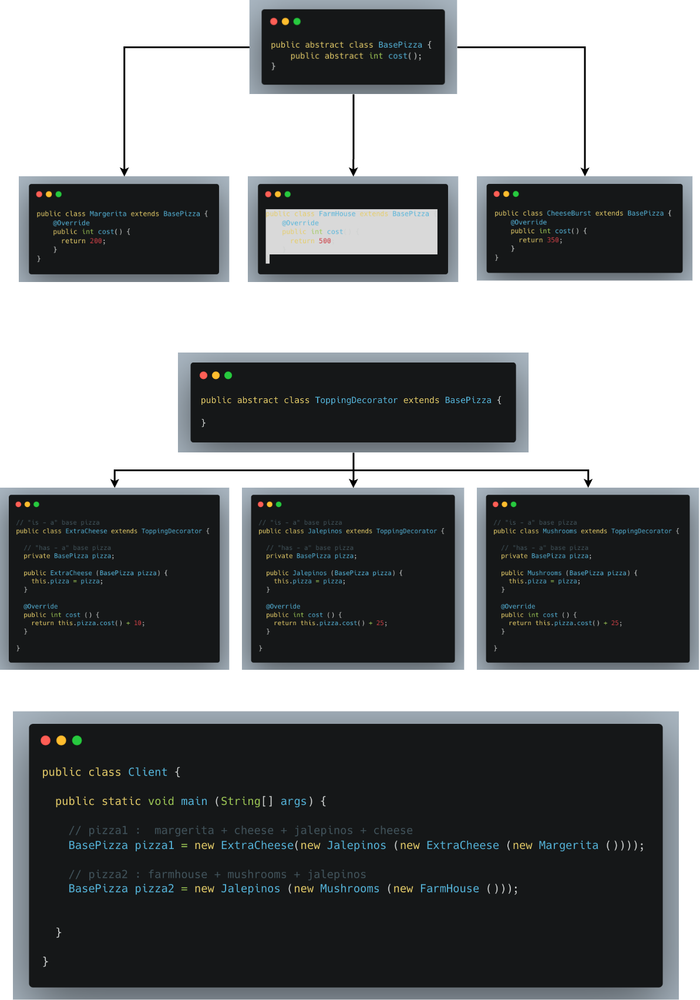

# Structural Design Patterns

## 4. Decorator Pattern
**Purpose:** Dynamically adds responsibilities to objects by wrapping them in additional functionality without altering the object itself. It provides an alternative to subclassing for extending behavior.

**Application:** Adding additional features (e.g., scrollbars or borders) to GUI components.

**Example**: Say you want to take an order for a pizza, with many possible combinations of toppings. Creating subclass to superclass Pizza for each combination would create Class Explosion. So we create a Decorative Layer on top that could accommodate multiple combinations but return the same class ultimately.
This decorating layer will have **both 'has-a' & 'is-a' relationships** with the base class.

  
